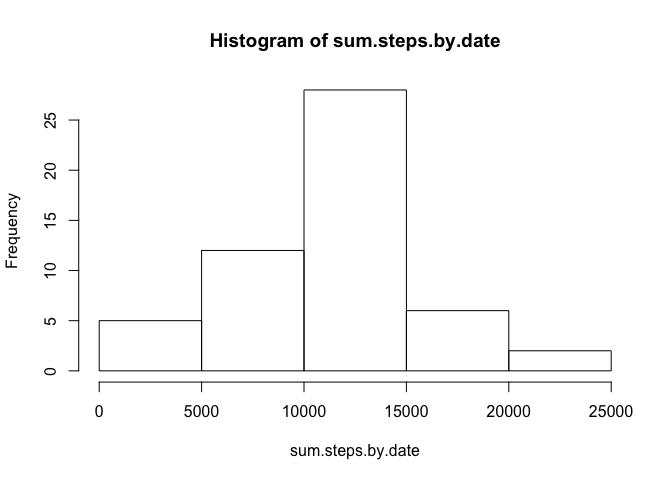

# Reproducible Research: Peer Assessment 1


## Assignment 
This assignment will be described in multiple parts. You will need to write a report that answers the questions detailed below. Ultimately, you will need to complete the entire assignment in a single R markdown document that can be processed by knitr and be transformed into an HTML file.

Throughout your report make sure you always include the code that you used to generate the output you present. When writing code chunks in the R markdown document, always use 𝚎𝚌𝚑𝚘 = 𝚃𝚁𝚄𝙴 so that someone else will be able to read the code. This assignment will be evaluated via peer assessment so it is essential that your peer evaluators be able to review the code for your analysis.

For the plotting aspects of this assignment, feel free to use any plotting system in R (i.e., base, lattice, ggplot2)

Fork/clone the GitHub repository created for this assignment. You will submit this assignment by pushing your completed files into your forked repository on GitHub. The assignment submission will consist of the URL to your GitHub repository and the SHA-1 commit ID for your repository state.

NOTE: The GitHub repository also contains the dataset for the assignment so you do not have to download the data separately.

## Loading and preprocessing the data

Show any code that is needed to

1. *Load the data (i.e. read.csv) *
2. *Process/transform the data (if necessary) into a format suitable for your analysis *

Data was downloaded as .zip file from "https://d396qusza40orc.cloudfront.net/repdata%2Fdata%2Factivity.zip", unzipped and read into R. 

Dates were transformed from string to date format.


```r
df <- read.csv(file="/Users/remco/R/20170113_Coursera/5. Reproducible Data Analysis/activity.csv")

df$date <- as.Date(df$date, "%Y-%m-%d")
```


## What is mean total number of steps taken per day?

For this part of the assignment, you can ignore the missing values in the dataset.

1. Calculate the total number of steps taken per day


```r
# split by date
steps.by.date <- split(df$steps, df$date)


# calculate the sum for each date
sum.steps.by.date <- sapply(steps.by.date, sum)
```

2. If you do not understand the difference between a histogram and a barplot, research the difference between them. Make a histogram of the total number of steps taken each day

```r
# histogram
hist(sum.steps.by.date)
```

<!-- -->

3. Calculate and report the mean and median of the total number of steps taken per day


```r
# print mean and median
mean(sum.steps.by.date, na.rm=TRUE)
```

```
## [1] 10766.19
```

```r
median(sum.steps.by.date, na.rm=TRUE)
```

```
## [1] 10765
```
## What is the average daily activity pattern?

1. Make a time series plot (i.e. 𝚝𝚢𝚙𝚎 = "𝚕") of the 5-minute interval (x-axis) and the average number of steps taken, averaged across all days (y-axis)


```r
# split by interval
df.by.interval <- split(df$steps, df$interval)

# exclude missing values
df.by.interval.compl <- lapply(df.by.interval, function(x) x[!is.na(x)])

# mean per interval
mean.df.by.interval.compl <- lapply(df.by.interval.compl, mean)

# prepare x and y for plotting
x <- c(1: length(mean.df.by.interval.compl)) / length(mean.df.by.interval.compl) * 24
y <- mean.df.by.interval.compl[c(1: length(mean.df.by.interval.compl))]

# plotting
plot(x = x, y = y, type="l", ylab="Mean activity (steps per 5 min interval)", xlab = "Hour", main= "Daily activity")
```

<!-- -->

2. Which 5-minute interval, on average across all the days in the dataset, contains the maximum number of steps?


```r
# interval number
paste(which.max(mean.df.by.interval.compl))
```

```
## [1] "104"
```

```r
# hours after midnight
paste(which.max(mean.df.by.interval.compl)/ length(mean.df.by.interval.compl) * 24)
```

```
## [1] "8.66666666666667"
```


## Imputing missing values

Note that there are a number of days/intervals where there are missing values (coded as 𝙽𝙰). The presence of missing days may introduce bias into some calculations or summaries of the data.

1. Calculate and report the total number of missing values in the dataset (i.e. the total number of rows with 𝙽𝙰s)

```r
mean(!complete.cases(df))
```

```
## [1] 0.1311475
```
2. Devise a strategy for filling in all of the missing values in the dataset. The strategy does not need to be sophisticated. For example, you could use the mean/median for that day, or the mean for that 5-minute interval, etc.
3. Create a new dataset that is equal to the original dataset but with the missing data filled in.


```r
# find missing values and replace them with median for that 5 min interval on other days
l <- nrow(df)
for (i in c(1:l)){
  if (paste(df[i,1]) == "NA") {
    # what interval is i
    interval.i <- df[i,"interval"]
    # all rows same interval
    interval.i.all <- subset(df, df$interval == interval.i)
    # median form interval
    median.i <- median(interval.i.all$steps, na.rm=TRUE)
    df[i,"steps"] <- median.i
    } 
  }
```


4. Make a histogram of the total number of steps taken each day and Calculate and report the mean and median total number of steps taken per day. Do these values differ from the estimates from the first part of the assignment? What is the impact of imputing missing data on the estimates of the total daily number of steps?

```r
# split by day (substituted NAs)
df.by.day <- split(df$steps, df$date)
# sum per day (substituted NAs)
sum.df.by.day <- sapply(df.by.day, sum)
# histogram
hist(sum.df.by.day, xlab = "Steps per day")
```

<!-- -->

```r
# mean per day (substituted NAs)
paste(mean(sum.df.by.day, na.rm=TRUE))
```

```
## [1] "9503.86885245902"
```

```r
# hours after midnight (substituted NAs)
paste(median(sum.df.by.day, na.rm=TRUE))
```

```
## [1] "10395"
```


## Are there differences in activity patterns between weekdays and weekends?

For this part the 𝚠𝚎𝚎𝚔𝚍𝚊𝚢𝚜() function may be of some help here. Use the dataset with the filled-in missing values for this part.

1. Create a new factor variable in the dataset with two levels – “weekday” and “weekend” indicating whether a given date is a weekday or weekend day.


```r
# weekdays
df$weekdays <- as.factor(weekdays(df$date))
levels(df$weekdays)
```

```
## [1] "Friday"    "Monday"    "Saturday"  "Sunday"    "Thursday"  "Tuesday"  
## [7] "Wednesday"
```

```r
levels(df$weekdays)[levels(df$weekdays) %in% c("Saturday", "Sunday")] <- "weekend"
levels(df$weekdays)[levels(df$weekdays) != "weekend"] <- "weekday"
```

2. Make a panel plot containing a time series plot (i.e. 𝚝𝚢𝚙𝚎 = "𝚕") of the 5-minute interval (x-axis) and the average number of steps taken, averaged across all weekday days or weekend days (y-axis). See the README file in the GitHub repository to see an example of what this plot should look like using simulated data.


```r
# split by weekday
df0 <- df[which(df$weekdays == "weekend"),]
df1 <- df[which(df$weekdays == "weekday"),]

df.by.interval0 <- split(df0$steps, df0$interval)
df.by.interval1 <- split(df1$steps, df1$interval)

# mean per interval
mean.df.by.interval0 <- lapply(df.by.interval0, mean)
mean.df.by.interval1 <- lapply(df.by.interval1, mean)

# prepare x and y for plotting
x0 <- c(1: length(mean.df.by.interval0)) / length(mean.df.by.interval0) * 24
x1 <- c(1: length(mean.df.by.interval1)) / length(mean.df.by.interval1) * 24

y0 <- mean.df.by.interval0[c(1: length(mean.df.by.interval0))]
y1 <- mean.df.by.interval1[c(1: length(mean.df.by.interval1))]

# plotting
par(mfrow=c(2,1))
plot(x = x0, y = y0, type="l", ylab="Steps per 5 min", xlab = "Hour", main= "Daily activity weekend")
plot(x = x1, y = y1, type="l", ylab="Steps per 5 min", xlab = "Hour", main= "Daily activity weekday")
```

<!-- -->

